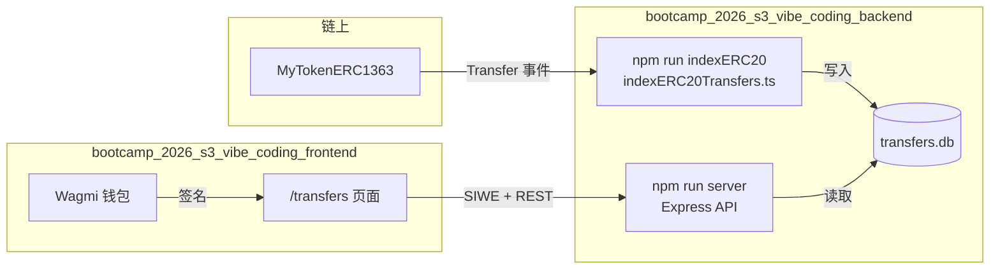
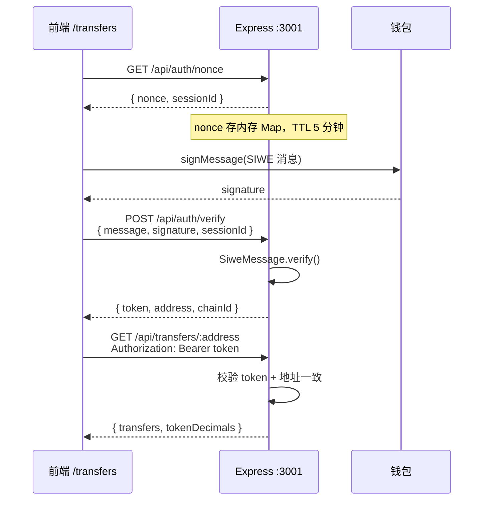

# SIWE 鉴权、扫链索引与前端交互

本文档说明 `bootcamp_2026_s3_vibe_coding_backend` 中 **ERC20 转账索引**、**SIWE 鉴权 API** 的实现，以及前端 `bootcamp_2026_s3_vibe_coding_frontend` 如何与之交互。

## 整体架构

项目拆成两个独立进程，共用同一个 SQLite 文件：



| 进程 | 命令 | 职责 |
|------|------|------|
| Indexer | `npm run indexERC20` | 扫链、监听 `Transfer`、落库 |
| API Server | `npm run server` | SIWE 鉴权、查 SQLite 返回 JSON |

---

## 一、扫链落库流程

**入口**：`src/token/indexERC20Transfers.ts`

**依赖配置**（`.env`）：

- `RPC_URL` — 链 RPC（建议 ws，回填会自动转 http）
- `TOKEN_ADDRESS` — MyTokenERC1363 合约地址
- `START_BLOCK` — 合约部署区块
- `CHAIN_ID` — `31337`（Anvil）或 `11155111`（Sepolia）
- `DATABASE_PATH` — 默认 `./data/transfers.db`

### 1. 启动与回填（Backfill）

1. 用 viem 创建 `publicClient`，连接 Anvil / Sepolia
2. 读 `sync_state.last_indexed_block`；若无记录，从 `START_BLOCK` 开始
3. 按 2000 区块一批调用 `eth_getLogs`，过滤 `Transfer(address,address,uint256)`
4. 每条 log 解析 `from / to / value`，再 `getBlock` 取时间戳
5. `INSERT OR IGNORE` 写入 `transfers` 表（主键 `txHash-logIndex`，防重复）
6. 更新 `sync_state.last_indexed_block`

### 2. 实时监听

回填完成后，`watchContractEvent` 订阅新 `Transfer` 事件，同样走 `persistLogs` 落库。

### 3. SQLite 表结构

**`transfers` 表**

| 字段 | 说明 |
|------|------|
| `id` | `txHash-logIndex`，主键 |
| `tx_hash` | 交易哈希 |
| `log_index` | 日志索引 |
| `block_number` | 区块号 |
| `block_timestamp` | 区块时间戳（Unix 秒） |
| `from_address` | 发送方（小写） |
| `to_address` | 接收方（小写） |
| `value` | 转账数量（wei 字符串） |
| `token_address` | 代币合约地址（小写） |

**`sync_state` 表**

| key | 说明 |
|-----|------|
| `last_indexed_block` | 已索引到的最新区块号 |

索引字段：`from_address`、`to_address`、`block_number`。

---

## 二、SIWE 鉴权流程

**实现文件**：

- `src/api/auth.ts` — nonce 生成、签名验证、token 解析
- `src/api/server.ts` — Express 路由



### Step 1：获取 nonce

```
GET /api/auth/nonce
→ { nonce, sessionId }
```

- `nonce` 由 `siwe` 库的 `generateNonce()` 生成
- `sessionId` 为 UUID，与 nonce 绑定存入内存 Map
- TTL：**5 分钟**

### Step 2：钱包签名（前端）

前端用 `SiweMessage` 构造标准 SIWE 文本，包含：

- `domain` — 当前页面 host
- `address` — 钱包地址
- `chainId` — 当前链 ID
- `nonce` — 上一步获取
- `uri`、`version`、`statement` 等

用户通过钱包 `signMessage` 完成签名。

### Step 3：后端验证

```
POST /api/auth/verify
Body: { message, signature, sessionId }
→ { token, address, chainId }
```

验证步骤：

1. 校验 `sessionId` 对应 nonce 未过期
2. `SiweMessage.verify({ signature, nonce })` 验签
3. 成功后签发 **base64url 编码的 JSON token**，包含：
   - `address`（小写）
   - `chainId`
   - `exp`（24 小时过期）
4. nonce **一次性使用**，验证后立即删除

### Step 4：受保护接口

```
GET /api/transfers/:address
Header: Authorization: Bearer <token>
```

- `requireAuth` 中间件解析 token，检查 `exp`
- **请求的 `:address` 必须等于 token 中的 address**，否则返回 403
- 从 SQLite 查询 `from_address = ? OR to_address = ?`
- 响应中为每条记录标注 `direction: "in" | "out"`

### API 一览

| 方法 | 路径 | 鉴权 | 说明 |
|------|------|------|------|
| GET | `/health` | 否 | 健康检查 |
| GET | `/api/auth/nonce` | 否 | 获取 SIWE nonce |
| POST | `/api/auth/verify` | 否 | 验证 SIWE 签名，返回 token |
| GET | `/api/transfers/:address` | Bearer token | 查询地址转账记录 |

---

## 三、前端交互流程

**相关文件**（`bootcamp_2026_s3_vibe_coding_frontend`）：

| 文件 | 职责 |
|------|------|
| `app/transfers/page.tsx` | 转账列表页面 |
| `hooks/useSiweAuth.ts` | SIWE 登录状态管理 |
| `lib/api.ts` | 后端 API 封装 |

### 1. 连接钱包

使用 Wagmi + Reown AppKit 连接 MetaMask 等钱包，获取 `address` 和 `chainId`。

### 2. SIWE 登录

用户点击「SIWE 登录」→ `useSiweAuth.signIn()`：

1. `fetchNonce()` → `GET /api/auth/nonce`
2. 构造 `SiweMessage`，调用 `signMessageAsync` 签名
3. `verifySiwe()` → `POST /api/auth/verify`
4. 将返回的 `token` 存入 `localStorage`（key: `siwe_auth_token`）

断开钱包时自动清除 token。

### 3. 拉取转账列表

登录成功后自动调用：

```ts
fetchTransfers(address, token)
// → GET /api/transfers/{address}
//   Header: Authorization: Bearer {token}
```

页面展示：转入/转出方向、金额、from/to、时间、区块号、tx hash。

### 4. 环境变量

**后端** `.env`：

```bash
PORT=3001
CORS_ORIGIN=http://localhost:3000
DATABASE_PATH=./data/transfers.db
TOKEN_DECIMALS=18
```

**前端** `.env.local`：

```bash
NEXT_PUBLIC_API_URL=http://localhost:3001
```

---

## 四、数据流小结

```
链上 Transfer 事件
    ↓  indexERC20（独立进程，需常驻）
SQLite transfers 表
    ↓  server 只读查询
Express REST API（SIWE 保护）
    ↓  fetch + Bearer token
前端 /transfers 列表展示
```

### 启动顺序

```bash
# 终端 1：索引（需常驻）
npm run indexERC20

# 终端 2：API 服务
npm run server

# 终端 3：前端（在 frontend 目录）
npm run dev
```

### 注意事项

1. **Indexer 和 Server 必须同时运行** — Indexer 负责写库，Server 负责读库
2. **Indexer 停止后** — 新转账不会入库，但已有数据仍可通过 API 查询
3. **前端必须用有转账记录的地址登录** — 且需完成 SIWE 签名后才能看到数据
4. **API 只允许查询当前登录地址** — 不能查询他人地址的转账记录
